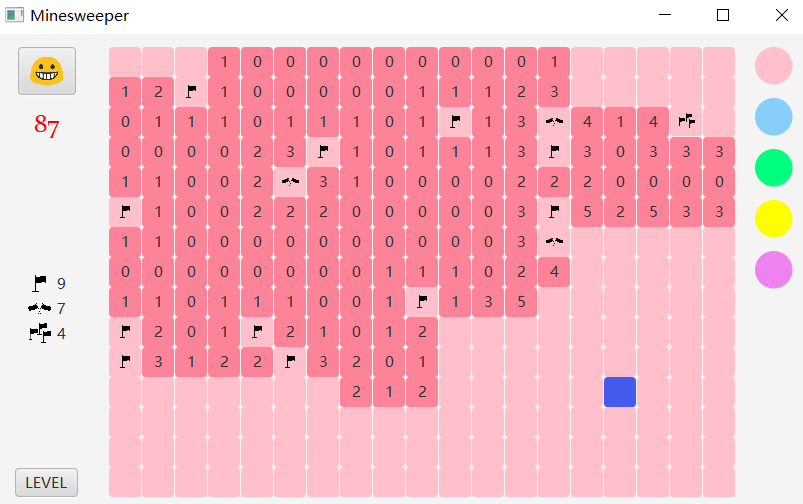

<p align="center"></p>

---

A Minesweeper game with multiple mines in one grid and user - defined UI.  

## Run Configurations  
```
--add-modules javafx.controls,javafx.fxml,javafx.media
```

## Functionalities  
<p align="center"></p>

* **Basic functionalities (classic game)**  
  *	User could choose different level or customize the number of bombs.  
  * Player can restart a new game.  
  * Indicate game’s state (lost, win, in progress, number of left flags, time spent in game)  
  * Generate a certain number of each type of bombs randomly.  
  * Players can open a cell by left click, and this may reveal mine(s) and the game ends, showing all mines’ position. If the cell is empty, it shows the number of adjacent mines, and reveal its adjacent cells if the number of adjacent mines is 0. 

* **Extended functionalities**  
  * User could customize the color of grids by drag the color shape into any grid.  
  * When the mouse hovers over the restart button, it will show hint text “New Game”; hovers over the level button, it will show “Choose Level”.  
  * When the mouse hovers over an unopened grid, this grid would turn blue to emphasize.  
  * The player could right click once to mark one flag in a cell, right click twice to mark two flags, right click three times to mark three flags, right click again to undo.
  * Add different sound effect when open an empty cell/win/lose.  
  * One grid may have multiple bombs, only mark the number of bombs in the grid correctly and mark all grids that has bomb, the player win.  


